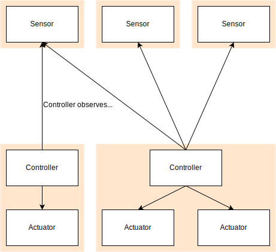

# Smart Home

There are three main classes/objects: sensors, actuators and controllers.
A controller reads data of all sensors it needs and then controls the actuators.

All sensors and actuators have a name and are assigned to a room.
They get instanciated in the main class and can be controlled by the CLI.

Controllers are packaged by use cases, e.g. there is one package for basic operations (lights, heating, ...), one for kitchen, security (alarms), ...

**PROBLEM**:
There needs to be a decision how to handle actuators which are normally controlled by sensors but can also be controlled directly/manually (e.g. Voice Assitant, Smartphone App).
Example: Based on the temperature sensor (22 °C) the controller would decide to set heating to level 2.
The heating is set to level 4 by Voice Assistant.
How should the controller handle this situation?

Possible solution:
Actuators have a flag whether they should be controlled automatically (by sensors / controllers) or whether they are set manually.
Actuators can be set back to 'auto' manually or there needs to be a way to automatically switch them back.
That would mean that controllers need to check whether an actuator is set manually and may decide to override it back to 'auto' based on several conditions (time since override, significant environmental/sensor changes, ...).

**Question**:
Should `Controller`'s behave as a `Proxy` for `Actuator`'s so that every `Actuator` has only one `Controller` through which it can be controlled.
This would mean that e.g. `Voice Controller` would need to access `Controller`'s instead of `Actuator`'s directly.

**IDEA**:
Use just one `FireAlertController` (`Singleton`?) which receives the whole `SmartHome` as an argument and can then take values of all `Sensor`'s it needs (`SmokeDetector`, `TemperatureSensor`, ...).
This could make it easier to implement new features for `FireAlertController` in the future.
